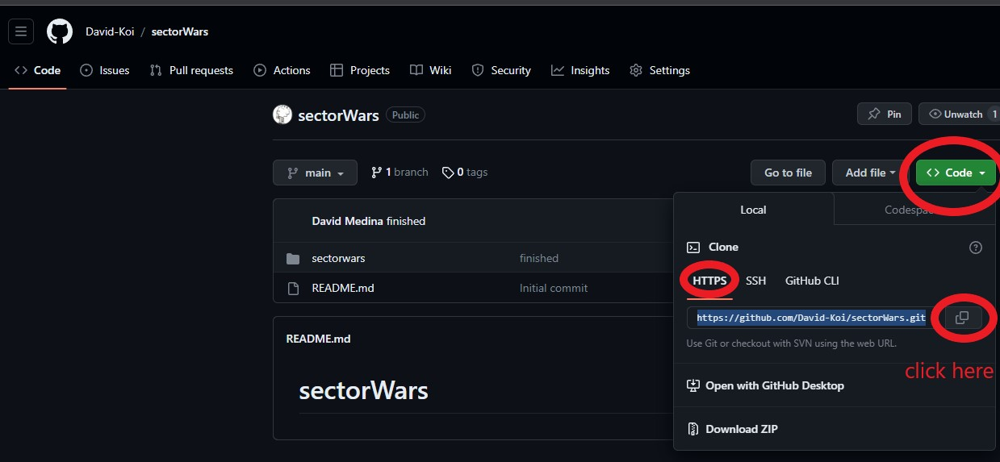

Hi! Thanks for your interest in my SectorWars project.

I´m David Medina, a junior web developer with a year of experience in front-end
develop.

Here is my technical test for a selection process by SectorAlarm company.

First at all you need clone my project in your computer.

                            INSTRUCTIONS TO CLONE AND EXECUTE

1 - Just follow the red circle from this picture  to copy the neccesary text.
2 - Open a terminal in your computer, go into the folder you prefere to clone the project.
3 - Once the project is already copied in your folder, open it with a code editor you prefere.
4 - Open a terminal in the editor and go into the sectorWars folder. You´ll find another sectorWars folder,
this README file and the picture with the instructions. Go into the second sectorWars folder.
5 - Now and here start your rebelion, rebel soldier. type the next comand in the console : "npm install", the node_modules folder must appear.
6 - Once the installation has finish, you can execute the TEST files with the comand: "npm run test", and 
you´ll check if the space ship is ready or not.
7 -  Now prepare your laser saber and type: "npm start".

                                INSTRUCTIONS TO USE THE APP
                WARNING!!! - the API is too slow sometimes, be patient, thanks!
    (you´ll see "pending" for a while in open the network window in your browser console)
- First at all, you can watch the introductory video with the plot of the film, it´s very exciting. You have a button 
in the lower right corner there is a button to unmute or mute the video. If you are in a hurry, you can use the video 
controls, you´ll see it if move the mouse.
- Automactly, the app load the first set of characters from "SWAPI: The Star Wars API", you´ll see ten cards
with the their names, birth years, genders (n/a if is a non human character) and in how many films they appears.
- If you press over "MORE DETAILS", a modal will be opened in the screen with more information about them, you can close it 
clicking out of modal.

- Below the cards have three buttons:
    *at the left, go back button, is inactive if is the first page.
    *at the center "MAIN", you return to the first set if you press it, is inactive if is the first page..
    *at the rigth, go next button, is inactive if is the last page.

- If there is any error, a MODAL will be dislpay with the error reason.

I expect you enjoy your space fly and defet the evil empire.

I wait for your feddback, thanks!

David Medina

https://www.linkedin.com/in/david-medina-bermudez/

